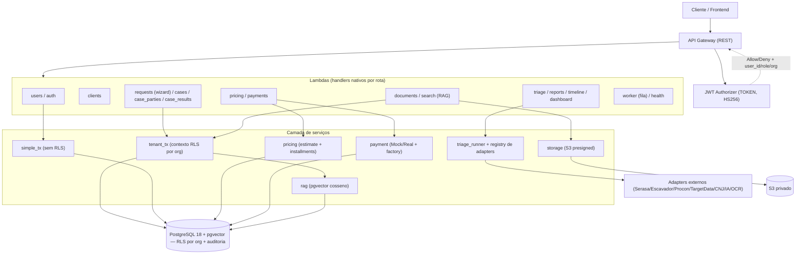
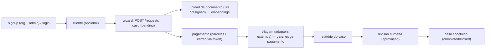

# Contrato Visto — Backend Serverless (AWS)

Backend **serverless** da plataforma LegalTech *Contrato Visto*, migrado de FastAPI
para **AWS Lambda (handlers nativos) + API Gateway**, sobre **PostgreSQL 18** com
**Row Level Security (RLS) multi-tenant por organização**, **pgvector** (busca
semântica), **S3** (documentos) e **SES** (e-mail). Autenticação por **JWT Authorizer**
no API Gateway.

> Esta etapa entrega o backend **migrado, multi-tenant, auditado e testado** contra um
> PostgreSQL 18 real. **Nenhum recurso AWS é criado por este repositório ainda** — o
> deploy (Fase 7) está planejado em `docs/PLANO_FASE7_DEPLOY.md`, e o endurecimento de
> deploy em `docs/security/fase7-hardening-checklist.md`.

## Estado Atual

- **Runtime:** AWS Lambda Python 3.11, **handlers nativos por rota** (sem FastAPI/Mangum).
- **API:** API Gateway REST + **JWT Authorizer** (TOKEN, HS256) injeta `user_id`/`role`/`organization_id`.
- **Multi-tenant:** cada conta pertence a uma **organização**; o isolamento é garantido por
  **RLS por `organization_id`** com `FORCE ROW LEVEL SECURITY` em todas as tabelas de negócio.
- **Banco:** PostgreSQL 18 + `pgvector`; **RLS** + **triggers de auditoria** (`audit.audit_log`).
- **Acesso a dados:** `tenant_tx` fixa `app.user_id`/`app.user_role`/`app.organization_id`
  por transação (`SET LOCAL`, seguro com pooling); o app conecta com role **não-owner**
  (`cv_app`, sem `BYPASSRLS`), então a RLS vale de verdade. `simple_tx` para tabelas globais.
- **Auth/Users:** **signup atômico cria organização + `admin`**; login (JWT com `exp`, carrega
  a org), CRUD, forgot/reset de senha (token **hasheado** + consumo atômico). `bcrypt` (rounds 12).
- **RBAC:** `admin` / `analyst` / `viewer` — escrita exige *writer* (`admin`/`analyst`),
  `viewer` é somente leitura.
- **Wizard de caso:** `POST /requests` orquestra a criação do caso (produto + módulos +
  partes + cliente opcional); o caso nasce com `payment_status=pending`.
- **Pricing & Parcelas:** catálogo produto × módulos, `estimate` com opções de parcelamento
  (Decimal/Price, sem juros até X + juros compostos exatos) e `installment_config` por organização.
- **Pagamento:** `POST /cases/{caseId}/payment` com **seam de pagamento** (Mock + Real
  placeholder + factory por env) pronto para gateway real; cartão via **token** (PAN/CVV
  nunca chegam ao backend); reserva atômica anti-dupla-cobrança + idempotência.
- **Gate de pagamento:** `PAYMENT_GATE=hard` bloqueia triagem/relatório sem pagamento (402).
- **Triagem:** executa os módulos via **registry de adapters externos** (Serasa/Escavador/
  Procon/TargetData/CNJ/IA/OCR — Mock + Real placeholder + factory por env), com cache de
  evidências; o caso expõe `provider_results` (evidências normalizadas por provider).
- **Relatório:** geração + **revisão humana** (aprovação) do relatório do caso.
- **Documentos:** upload/download por **URL S3 pré-assinada** (o arquivo não passa pela Lambda);
  ingestão OCR→chunks→embeddings com **fila SQS/DLQ** (SP1).
- **Busca (RAG):** embeddings 1536-dim (OpenAI ou mock) + pgvector (cosseno), herda a RLS por org.
- **Backends abstratos** (real ou mock/local) selecionáveis por ambiente: `STORAGE` (S3/local),
  `EMAIL` (SES/log), `EMBEDDINGS` (OpenAI/mock), `OCR`, `PAYMENT`, e cada adapter externo (`*_BACKEND`).
- **Segurança fail-closed:** `enforce_production_safety` bloqueia o boot fora de dev se houver
  segredo padrão ou backend mock/local (inclui pagamento e OCR).
- **Qualidade:** **478 funções de teste** de integração contra PostgreSQL 18 (43 arquivos);
  **21 migrations**; **67 rotas** + JWT Authorizer.

## Arquitetura



## Fluxo Operacional



## Endpoints

| Domínio | Rotas | Acesso |
|---------|-------|--------|
| Health | `GET /health` | público |
| Auth/Users | `POST /users` (signup → cria org + admin), `POST /users/login`, `POST /auth/login`, `POST /users/forgot-password`, `POST /users/reset-password` | público |
| Users (perfil/admin) | `GET /me` · `GET /auth/me` · `GET /users` · `GET/PUT/DELETE /users/{userId}` | **JWT** (RBAC) |
| Clients | `POST/GET /clients` · `GET/PUT/DELETE /clients/{clientId}` | **JWT** (escrita = writer) |
| Casos (wizard) | `POST /requests` · `GET /requests/{requestId}` · `POST/GET /cases` · `GET /cases/{caseId}` · `GET /cases/{caseId}/aggregate` · `PUT/PATCH/DELETE /cases/{caseId}` | **JWT** (RLS por org) |
| Partes | `POST/GET /cases/{caseId}/parties` · `PUT/DELETE /cases/{caseId}/parties/{partyId}` | **JWT** |
| Timeline | `GET /cases/{caseId}/timeline` | **JWT** |
| Pricing | `GET /pricing` (catálogo) · `POST /pricing/estimate` · `GET/PUT /pricing/config` · `POST /pricing/config/limit-check` | **JWT** |
| Pagamento | `POST /cases/{caseId}/payment` (parcelas + cartão via token) | **JWT** (writer) |
| Triagem | `GET /cases/{caseId}/triage` · `POST /cases/{caseId}/triage/run` | **JWT** (writer) |
| Relatório | `GET /cases/{caseId}/report` · `POST /cases/{caseId}/report/generate` · `POST /cases/{caseId}/report/review` | **JWT** (writer) |
| Dashboard | `GET /dashboard/stats` | **JWT** |
| Documentos | `POST/GET /documents` · `GET /documents/{docId}` · `GET /documents/{docId}/download-url` · `POST /documents/{docId}/process` · `POST /documents/{docId}/enqueue-processing` | **JWT** |
| Case-results | `POST/GET /case-results` · `GET/PUT/DELETE /case-results/{resultId}` | **JWT** |
| Busca (RAG) | `POST /search` | **JWT** |

Rotas **JWT** passam pelo authorizer; `health`, signup, login e forgot/reset são públicas.

## Estrutura

```text
contrato_visto_backend/
├── src/
│   ├── handlers/      # requests, cases, case_parties, case_results, clients, documents,
│   │                  #   pricing, payments, triage, reports, timeline, dashboard, search,
│   │                  #   users, worker, health
│   ├── adapters/      # payment + externos (serasa/escavador/procon/targetdata/cnj/ia/ocr) + registry
│   ├── authorizers/   # jwt_authorizer (TOKEN authorizer)
│   ├── schemas/       # Pydantic 2 (case, client, document, search, user, pricing, ...)
│   ├── services/      # database, email, embeddings, rag, storage, case_lifecycle,
│   │                  #   triage_runner, report_generator, pricing/ (estimate + installments)
│   └── utils/         # auth, context, helpers, lambda_io, safety
├── migrations/        # 001–021 (RLS por dono → por organização, pipeline, pricing, parcelas,
│                      #   custos de APIs externas, tributos/notas fiscais, trilha de auditoria)
├── tests/             # 478 funções de teste de integração (pytest + PG18)
├── docs/              # PROGRESSO, PLANO_MIGRACAO_SERVERLESS, PLANO_FASE7_DEPLOY,
│                      #   security/fase7-hardening-checklist, dicionario_de_dados, specs/plans
├── serverless.yml     # 67 rotas + authorizer + IAM + SSM por stage
├── requirements.txt   # runtime (psycopg2, boto3, openai, pydantic, PyJWT, bcrypt, ...)
├── requirements-dev.txt
└── conftest.py
```

## Segurança & RLS

- **Isolamento multi-tenant (RLS por organização):** todas as tabelas de negócio
  (`cases`/`case_results`/`documents`/`clients`/`requests`/`case_parties`/`document_chunks`/
  `document_embeddings`/`pricing_configs`...) têm RLS por `organization_id` com
  **`FORCE ROW LEVEL SECURITY`**; o app conecta com role **não-owner** (`cv_app`), então a
  RLS vale de verdade. `organization_id` vem **do token**, nunca do corpo da requisição.
- **RBAC:** escrita exige `admin`/`analyst`; `viewer` é somente leitura.
- **Pagamento (PCI):** o número do cartão/CVV **nunca** chega ao backend — o cliente tokeniza e
  envia apenas o token + hints; o schema é `extra="forbid"`; `to_public()` aplica allowlist ao
  que é persistido. Reserva atômica anti-dupla-cobrança + idempotência com hash do token.
- **PII (LGPD):** `document_number`/`rg` mascarados e contato/endereço ocultos para `viewer`;
  logs nunca expõem PII (email/CPF/token) nem `str(e)` — só `type(e).__name__`; auditoria de
  mutação registra o recurso.
- **Auth:** JWT HS256 com `exp` exigido; reset token guardado como **hash** e de uso único
  (atômico); `bcrypt` (≤72 bytes validados); sem segredo padrão.
- **Proteções de negócio:** cliente inativo não recebe casos; caso finalizado não aceita escrita
  (`assert_case_writable`, atômico); **anti-lockout** do último admin; triagem/relatório exigem
  pagamento quando `PAYMENT_GATE=hard`.
- **Robustez de input:** corpo precisa ser objeto JSON; rejeita `NaN`/`Infinity`/null byte;
  limite de 1 MB; paginação com teto; SQL 100% parametrizado.
- **Fail-safe:** stage desconhecido é tratado como produtivo; backends mock/local/log e segredo
  fraco **bloqueiam o boot** fora de dev.
- **Endurecimento de deploy pendente** (rate limiting/WAF, CORS por origem, escopo SES,
  auditoria de leitura de PII): catalogado em `docs/security/fase7-hardening-checklist.md`.

## Ambiente local (testes contra PostgreSQL 18 real)

```powershell
# 1) Subir o PostgreSQL 18 + pgvector (Docker)
docker run -d --name cv-pg18 -e POSTGRES_DB=contrato_visto `
  -e POSTGRES_USER=dbadmin -e POSTGRES_PASSWORD=localdev_cv `
  -p 5433:5432 pgvector/pgvector:pg18

# 2) Restaurar schema + criar role de app NÃO-owner (cv_app) + aplicar migrations 001..021
#    (ver docs/PROGRESSO.md — seção "Como RETOMAR o ambiente")

# 3) venv + dependências de teste
python -m venv .venv
.venv\Scripts\python.exe -m pip install -r requirements-dev.txt

# 4) Rodar a suíte (.env local com DB em localhost:5433, role cv_app)
.venv\Scripts\python.exe -m pytest tests/ -q
```

> `.env` real **nunca** é versionado (está no `.gitignore`). Em produção os segredos ficam no
> **AWS SSM** por stage. Os segredos no repo são apenas do banco **local** de teste.

## Migrations

| Arquivo | O que faz |
|---------|-----------|
| `001_rls_policies.sql` | policies RLS de escrita (cases/case_results/documents) + auditoria `SECURITY DEFINER` |
| `002_fix_audit_delete.sql` | corrige `resource_id` na auditoria de DELETE (`COALESCE(NEW.id, OLD.id)`) |
| `003_perf_indexes.sql` | índices de RLS/listagem (validados via `EXPLAIN ANALYZE`) |
| `004_integrity_indexes.sql` | `UNIQUE` em `password_resets.user_id` + índices de listagem |
| `005_organizations.sql` | tabela `organizations` + RLS (fundação multi-tenant) |
| `006_users_multitenant_auth.sql` | `users.id` → uuid + `organization_id`; signup cria org+admin |
| `007_rls_por_organizacao.sql` | migra a RLS de **por-dono** para **por organização** (`FORCE`) |
| `008_requests_case_parties.sql` | `requests` (wizard) + `case_parties` |
| `009_pipeline_pricing.sql` | pipeline de execução + catálogo/config de pricing |
| `010_chunks_audit_timeline.sql` | `document_chunks`/`document_embeddings` com org+RLS + timeline |
| `011_cases_product_fields.sql` | campos de produto no caso |
| `012_case_reports.sql` | relatórios do caso |
| `013_audit_pricing.sql` | auditoria de alterações de pricing |
| `014_audit_core_triggers.sql` | triggers de auditoria das tabelas core |
| `015_clients_rg.sql` | campo `rg` em `clients` |
| `016_org_created_indexes.sql` | índices compostos `(organization_id, created_at DESC)` |
| `017_installments.sql` | `installment_config` + `payment` em `requests` |

## Deploy (Fase 7) — planejado

Runbook completo em **`docs/PLANO_FASE7_DEPLOY.md`**; checklist de endurecimento de segurança
em **`docs/security/fase7-hardening-checklist.md`**. Resumo:
- Região **`sa-east-1`**; estratégia em 2 etapas (**7a dev econômico** → **7b prod completo**).
- Alvo de produção: **RDS privado + Lambda em VPC + RDS Proxy**; segredos no **SSM por stage**;
  bucket S3 privado; SES verificado.
- Endurecimento de deploy: **rate limiting/WAF** nas rotas públicas de auth, **CORS por origem**,
  escopo de `ses:SendEmail`, auditoria de leitura de PII, gateway de pagamento real.
- O deploy é executado pelo responsável da conta AWS (não automatizado por este repositório).

## Fora do escopo atual

- Deploy real na AWS (Fase 7) e criação de RDS/VPC/S3/SES/IAM.
- Frontend (mantido em repositório separado).
- **Adapters externos reais:** hoje operam em **mock** (o esqueleto Real + factory está pronto);
  as integrações reais (Serasa/Escavador/Procon/TargetData/CNJ) + OCR real (Textract) + gateway
  de pagamento real são wiring da Fase 7 (chaves via SSM).
- Endurecimentos de produção pendentes (ver checklist): revogação de sessão (token versioning),
  rate limiting/WAF, CORS por origem, confirmação de upload (`HeadObject`) + cleanup S3 no delete,
  keyset pagination, auditoria persistente de acesso a PII.
- Worker assíncrono da **triagem** via fila — hoje a triagem roda **síncrona**; apenas a ingestão
  de documentos (SP1) tem fila SQS/DLQ.

## Fila assíncrona de processamento de documentos (SP1)

`POST /documents/{docId}/enqueue-processing` enfileira a ingestão (OCR→chunks→embeddings).
Na AWS publica em SQS (`DocumentProcessingQueue`) e a Lambda `documentProcessingWorker`
processa cada mensagem; falhas transitórias voltam à fila e, após `maxReceiveCount=3`,
vão para a DLQ. Idempotência por `(organization_id, job_id)` em `agent_executions` +
lock por documento; falhas determinísticas são marcadas e confirmadas (ack). Em dev
(`QUEUE_BACKEND` ausente) o processamento é inline/síncrono. `POST /documents/{docId}/process`
segue como reprocessamento síncrono (force).
