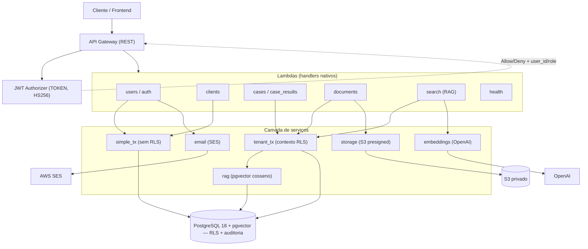
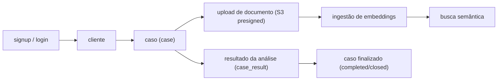

# Contrato Visto — Backend Serverless (AWS)

Backend **serverless** da plataforma LegalTech *Contrato Visto*, migrado de FastAPI
para **AWS Lambda (handlers nativos) + API Gateway**, sobre **PostgreSQL 18** com
**Row Level Security (RLS)**, **pgvector** (busca semântica), **S3** (documentos) e
**SES** (e-mail). Autenticação por **JWT Authorizer** no API Gateway.

> Esta etapa entrega o backend **migrado, auditado e testado** contra um PostgreSQL 18
> real. **Nenhum recurso AWS é criado por este repositório ainda** — o deploy (Fase 7)
> está planejado em `docs/PLANO_FASE7_DEPLOY.md`.

## Estado Atual

- **Runtime:** AWS Lambda Python 3.11, **handlers nativos por rota** (sem FastAPI/Mangum).
- **API:** API Gateway REST + **JWT Authorizer** (TOKEN, HS256) injeta `user_id`/`role`.
- **Banco:** PostgreSQL 18 + `pgvector`; **RLS** + **triggers de auditoria** (`audit.audit_log`).
- **Acesso a dados:** `tenant_tx` (fixa `app.user_id`/`app.user_role` por transação =
  `SET LOCAL`, seguro com pooling) para tabelas com RLS; `simple_tx` para tabelas globais.
- **Auth/Users:** signup público (cria sempre `viewer`), login (JWT com `exp`), CRUD,
  forgot/reset de senha (token **hasheado** + consumo atômico). `bcrypt` (rounds 12).
- **RBAC:** `admin` / `analyst` / `viewer` — `viewer` é somente leitura.
- **Documentos:** upload/download por **URL S3 pré-assinada** (o arquivo não passa pela Lambda).
- **Busca (RAG):** embeddings 1536-dim (OpenAI ou mock) + pgvector (cosseno); a busca
  herda a RLS de `documents`.
- **Backends abstratos** (real ou mock/local) selecionáveis por ambiente: `STORAGE`
  (S3/local), `EMAIL` (SES/log), `EMBEDDINGS` (OpenAI/mock).
- **Segurança fail-closed:** `enforce_production_safety` bloqueia o boot fora de
  ambiente de dev se houver segredo padrão ou backend mock/local.
- **Qualidade:** **141 testes** de integração contra PostgreSQL 18; **4 migrations**.

## Arquitetura



## Fluxo Operacional



## Endpoints

| Método | Rota | Acesso | Descrição |
|--------|------|--------|-----------|
| GET | `/health` | público | API + conectividade com o banco |
| POST | `/users` | público | signup (cria `viewer`) |
| POST | `/users/login` | público | login → JWT |
| POST | `/users/forgot-password` · `/users/reset-password` | público | recuperação de senha |
| GET/PUT/DELETE | `/users/{id}` · GET `/users` | **JWT** | perfil/admin (RBAC) |
| POST/GET/PUT/DELETE | `/clients` · `/clients/{id}` | **JWT** | catálogo de clientes (escrita = writer) |
| POST/GET/PUT/DELETE | `/cases` · `/cases/{id}` | **JWT** | casos (RLS por dono) |
| POST/GET/PUT/DELETE | `/case-results` · `/case-results/{id}` | **JWT** | resultados (RLS por dono) |
| POST | `/documents` | **JWT** | registra documento + URL S3 pré-assinada |
| GET | `/documents/{id}` | **JWT** | metadados + URL de download |
| POST | `/search` | **JWT** | busca semântica (pgvector) |

Rotas **JWT** passam pelo authorizer; `health`, signup, login e forgot/reset são públicas.

## Estrutura

```text
contrato_visto_backend/
├── src/
│   ├── handlers/      # cases, case_results, clients, documents, search, users, health
│   ├── authorizers/   # jwt_authorizer (TOKEN authorizer)
│   ├── schemas/       # Pydantic 2 (case, client, document, search, user)
│   ├── services/      # database, email, embeddings, rag, storage
│   └── utils/         # auth, context, helpers, lambda_io, safety
├── migrations/        # 001 RLS · 002 auditoria DELETE · 003 índices · 004 integridade
├── tests/             # 141 testes de integração (pytest + PG18)
├── docs/              # PROGRESSO, PLANO_MIGRACAO_SERVERLESS, PLANO_FASE7_DEPLOY, dicionario_de_dados
├── serverless.yml     # 28 functions + authorizer + IAM + SSM por stage
├── requirements.txt   # runtime (psycopg2, boto3, openai, pydantic, PyJWT, bcrypt, ...)
├── requirements-dev.txt
└── conftest.py
```

## Segurança & RLS

- **Isolamento por dono (RLS):** `cases`/`case_results` (`created_by`), `documents`
  (`uploaded_by`) — o app conecta com role **não-owner** (sem `BYPASSRLS`), então a RLS
  vale de verdade. `clients` é catálogo compartilhado; `users` não tem RLS.
- **RBAC:** escrita exige `admin`/`analyst`; `viewer` é somente leitura.
- **PII (LGPD):** `document_number` mascarado e contato/endereço ocultos para `viewer`;
  logs nunca expõem PII (email/CPF/token) nem `str(e)`; auditoria de DELETE registra o recurso.
- **Auth:** JWT HS256 com `exp` exigido; reset token guardado como **hash** e de uso único
  (atômico); `bcrypt` (≤72 bytes validados); sem segredo padrão.
- **Proteções de negócio:** cliente inativo não recebe casos; case finalizado não aceita
  escrita; **anti-lockout** do último admin.
- **Robustez de input:** corpo precisa ser objeto JSON; rejeita `NaN`/`Infinity`/null byte;
  limite de 1 MB; paginação com teto; SQL parametrizado.
- **Fail-safe:** stage desconhecido é tratado como produtivo; backends mock/local/log e
  segredo fraco **bloqueiam o boot** fora de dev.

## Ambiente local (testes contra PostgreSQL 18 real)

```powershell
# 1) Subir o PostgreSQL 18 + pgvector (Docker)
docker run -d --name cv-pg18 -e POSTGRES_DB=contrato_visto `
  -e POSTGRES_USER=dbadmin -e POSTGRES_PASSWORD=localdev_cv `
  -p 5433:5432 pgvector/pgvector:pg18

# 2) Restaurar schema + criar role de app NÃO-owner (cv_app) + aplicar migrations 001..004
#    (ver docs/PROGRESSO.md — seção "Como RETOMAR o ambiente")

# 3) venv + dependências de teste
python -m venv .venv
.venv\Scripts\python.exe -m pip install -r requirements-dev.txt

# 4) Rodar a suíte (.env local com DB em localhost:5433, role cv_app)
.venv\Scripts\python.exe -m pytest tests/ -q
```

> `.env` real **nunca** é versionado (está no `.gitignore`). Em produção os segredos
> ficam no **AWS SSM** por stage. Os segredos no repo são apenas do banco **local** de teste.

## Migrations

| Arquivo | O que faz |
|---------|-----------|
| `001_rls_policies.sql` | policies RLS de escrita (cases/case_results/documents) + auditoria `SECURITY DEFINER` |
| `002_fix_audit_delete.sql` | corrige `resource_id` na auditoria de DELETE (`COALESCE(NEW.id, OLD.id)`) |
| `003_perf_indexes.sql` | índices de RLS/listagem (validados via `EXPLAIN ANALYZE`) |
| `004_integrity_indexes.sql` | `UNIQUE` em `password_resets.user_id` + índices de listagem |

## Deploy (Fase 7) — planejado

Runbook completo em **`docs/PLANO_FASE7_DEPLOY.md`**. Resumo:
- Região **`sa-east-1`**; estratégia em 2 etapas (**7a dev econômico** → **7b prod completo**).
- Alvo de produção: **RDS privado + Lambda em VPC + RDS Proxy**; segredos no **SSM por stage**;
  bucket S3 privado; SES verificado.
- O deploy é executado pelo responsável da conta AWS (não automatizado por este repositório).

## Fora do escopo atual

- Deploy real na AWS (Fase 7) e criação de RDS/VPC/S3/SES/IAM.
- Frontend (mantido em repositório separado).
- Endurecimentos de produção pendentes: revogação de sessão (token versioning),
  rate limiting/WAF, confirmação de upload (`HeadObject`) + cleanup S3 no delete,
  keyset pagination, auditoria persistente de acesso a PII.
- Worker assíncrono da triagem (SP3) via fila — hoje a triagem roda síncrona; só a
  ingestão de documentos (SP1) tem fila SQS/DLQ.

## Fila assíncrona de processamento de documentos (SP1)

`POST /documents/{id}/enqueue-processing` enfileira a ingestão (OCR→chunks→embeddings).
Na AWS publica em SQS (`DocumentProcessingQueue`) e a Lambda `documentProcessingWorker`
processa cada mensagem; falhas transitórias voltam à fila e, após `maxReceiveCount=3`,
vão para a DLQ. Idempotência por `(organization_id, job_id)` em `agent_executions` +
lock por documento; falhas determinísticas são marcadas e confirmadas (ack). Em dev
(`QUEUE_BACKEND` ausente) o processamento é inline/síncrono. `POST /documents/{id}/process`
segue como reprocessamento síncrono (force).
